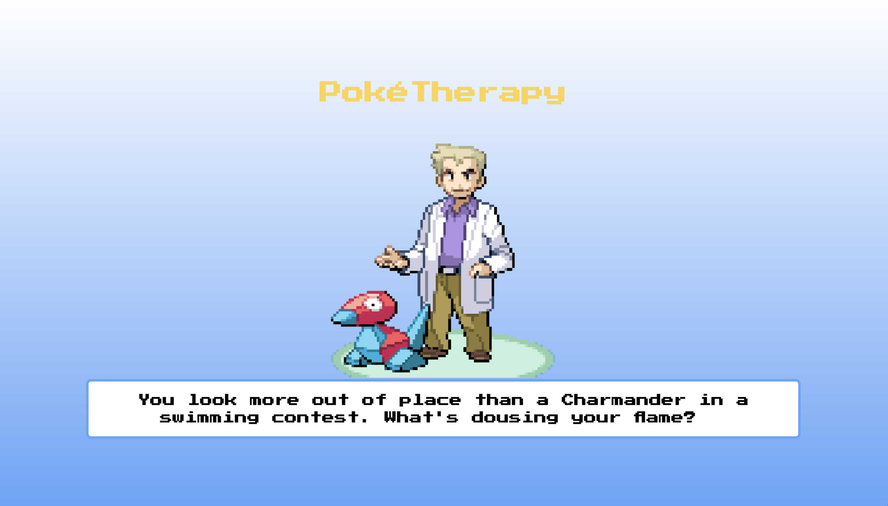

# PokeTherapy & Cocktail Generator 🌟
 The Pokemon Therapist is a web application that integrates the power of ChatGPT, PokeApi, and Cocktail database Api to provide a Pokemon-themed therapy session. Users can also receive personalized cocktail recommendations creating a unique and enjoyable experience. We believe in honesty, and it's only fair to let you know that our Pokemon Therapist has a distinctive style that some might find...well, interesting. 
In summary, our Pokemon Therapist adds a sprinkle of Pokemon charm to the therapy experience and doubles as your go-to virtual bartender. If you're seeking a more traditional therapeutic approach, you might want to consult a human therapist. But if you're up for a unique and amusing experience, the Pokemon Therapist is here for you!

## Technologies Used

PokeAPI (https://pokeapi.co/): For powering our Pokemon generator and adding a touch of Pokemon magic to our therapist's responses.

OpenAI (https://platform.openai.com/docs/api-reference): For providing the ChatGPT API, making the engaging conversations with our Pokemon Therapist possible.

The Cocktail Database API (https://www.thecocktaildb.com/): For supplying a diverse collection of drink recipes, and receiving personalized cocktail recommendations.

These contributions have been instrumental in bringing the Pokemon Therapist web application to life, and we appreciate the support of these valuable resources.
